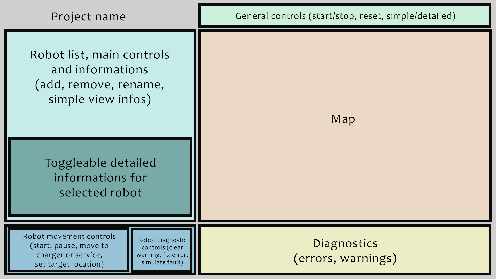

# UI layout

# General remarks
- This UI guide was made based on .
- After running the application, every section should be on screen without the need of resizing (for normal computer screens).
- Every panel should display its name on the top left corner.

# General controls
Consists of three buttons:
- Start/Stop simulation
  * one button, after pressing start it changes to stop, and the other way around
  * or two buttons, and they are alternately active (exclusive or)
  * choose what is easier to make
- Reset simulation
- Simple/Detailed view
  * same options as at the Start/Stop button
  * toggles the detailed robot informations panel

# Robot list
Here are all the robots displayed in rows, and here are they selected.
The control buttons are on the top: Add, Rename, Remove. The last to only works if a robot is selected.
The displayed informations of the robots in each row are written in the 
Client buttons/Viewbuttons/Simple view section.

## Toggleable detailed informations panel
This is only displayed if the Simple/Detailed view button is set to Detailed view.
It appears at the bottom of the Robot list panel, and shortens the displayed robot list (and if there are lots of robots, it should be scrollable).
It displayes the detailed informations for the selected robot only. The displayed informations are written in the 
Client buttons/Viewbuttons/Detailed view section.
If no robot is selected, it shows "No robot selected."

# Map
The map should be scaled to the panel size. Maybe can include some informations about what means what.

## Robots on the map
They are a circle or square (circle is better because you can see what cell is under the robot), and have a smaller circle or square inside.
The inside represents if they are loaded or not, the outside represents their state.
Colors and meanings:
- Inside
  * Gray: Unloaded
  * Brown: Carrying load
- Outside:
  * Green: Ready
  * Blue: Moving, loading or unloading
  * Yellow: Charging or paused
  * Red: Error or emergency stop
  * Gray: Disconnected

# Robot controls
These only work if a robot is selected, otherwise they are inactive.
Consists of two parts:
- Movement control buttons
  * Resume robot (I like Start robot better)
  * Pause robot
  * Move to charger
  * Move to service
  * Set target location manually (two field to write x,y coordinates + a Set button)
- Diagnostic buttons
  * Clear warning
  * Fix error in place
  * Simulate fault

# Diagnostics
Here are displayed all the warnings and errors for all robots in seperate rows.
